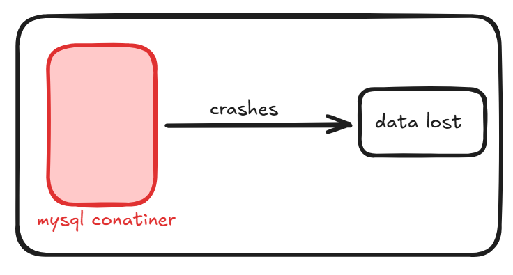
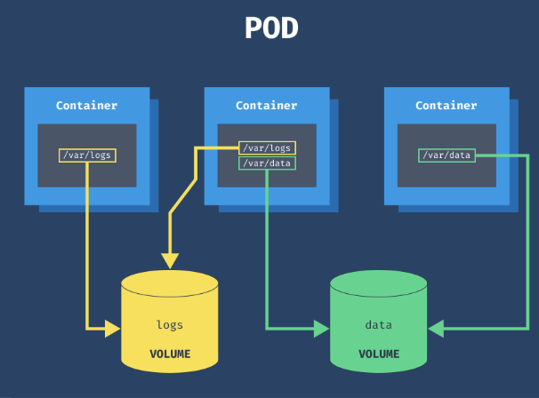
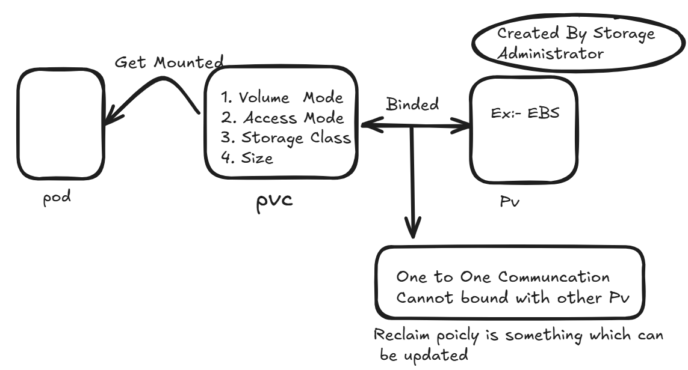

Volume:- It is a storage mechanism which allow data to store even after the container / pod dies so that it can stay longer

To avoid this we attach a Storage to it so that it can hold the data 

-------------------------------------------------------------------------------------

Types of Volume :

In general there are three type of Volume in K8s:

1) Ephemeral Volume : 

Empty Dir:- The most basic volume type is an empty directory (emptyDir). When you create a Volume with the emptyDir type, Kubernetes creates it when it assigns a Pod to a node. The Volume exists for as long as the Pod is running. As the name suggests, it is initially empty, but the containers can write and read from the Volume. Once you delete the Pod, Kubernetes deletes the Volume as well.
    Within a pod if we have 2 containers they both can communicate kusing this
    It is similar to tmps in docker but the difference is tmps is attached to container and empytydir is attached to pod 
    Some uses for an emptyDir are:
        scratch space, such as for a disk-based merge sort
        checkpointing a long computation for recovery from crashes
        holding files that a content-manager container fetches while a webserver container serves the data

        Example :

        apiVersion: v1
        kind: Pod
        metadata:
          name: test-pd
        spec:
          containers:
          - image: registry.k8s.io/test-webserver
            name: test-container
            volumeMounts:
            - mountPath: /cache
              name: cache-volume
          volumes:
          - name: cache-volume
            emptyDir:
              sizeLimit: 500Mi

Congimap:- A ConfigMap provides a way to inject configuration data into pods. The data stored in a ConfigMap can be referenced in a volume of type configMap and then consumed by containerized applications running in a pod.

    When referencing a ConfigMap, you provide the name of the ConfigMap in the volume

    Example:
    apiVersion: v1
    kind: Pod
    metadata:
      name: configmap-pod
    spec:
      containers:
        - name: test
          image: busybox:1.28
          command: ['sh', '-c', 'echo "The app is running!" && tail -f /dev/null']
          volumeMounts:
            - name: config-vol
              mountPath: /etc/config
      volumes:
        - name: config-vol
          configMap:
            name: log-config
            items:
              - key: log_level
                path: log_level.conf

2) Node Specific Volume :
These type of Volume are attached to the specific Node rather than pod directly

HostPath:- This Runs on the machine where pod get created lets say a pod get creater on worker node  so masternode cannot see the data inside the volume of this worker node.

This uses Nodes Local Storage 

3) Persistent Volume :-
Independent of Pod 
Piece of Storage Inside the Cluster 
Storage Provisioned in the ClUSTER 
A PersistentVolume (PV) is a piece of storage in the cluster that has been provisioned by an administrator or dynamically provisioned using Storage Classes.

In Kubernetes, a persistent volume (PV) is an object that provides pods with access to persistent storage resources.

PVs are volume plugins like Volumes, but have a lifecycle independent of any individual Pod that uses the PV.

A PersistentVolumeClaim (PVC) is a request for storage by a user.

Persistent volumes are external to pods, and any data the pod writes to the storage will remain intact after the pod shuts down.

PV and Pv ARE Objects used to retain the pods data even long after it is destroyed 

----------------------------------------------------------------------------------------
How Pod Is connected to PV ?

PersistentVolume (PV) Creation: An administrator provisions a PV, which is a piece of storage in the cluster. This storage can be backed by various systems, such as NFS, iSCSI, or cloud provider-specific storage like AWS EBS or Google Persistent Disk. 

PersistentVolumeClaim (PVC) Creation: A user (developer) creates a PVC, which is a request for storage. The PVC specifies the desired storage size, access modes, and, optionally, a storage class. 

Binding: Kubernetes matches the PVC with a suitable PV based on the requested size, access modes, and storage class. Once a match is found, the PV and PVC are bound together. 

Pod Configuration: The developer then creates a Pod specification that references the PVC. In the Pod's YAML file, the PVC is specified under the volumes section, and the mount path within the container is defined under volumeMounts.

Mounting: When the Pod is scheduled onto a node, Kubernetes ensures that the bound PV is mounted into the container at the specified mount path. This allows the container to read from and write to the persistent storage.

In simple Words When we Create a pod and attach it to a volume it directly cannot communicate with each other that is because  pod falles under namespace and volume is something which is independent of the pod so it doesnt fallunder  namespace object category . 
So they cant comminicate directly For this We needed PVC . PVC dont have knowledge where it is getting stored . When we create a pod we create a PVC  that knows couple of things by which a PV can be Binded to it 
Like 
Size: The size of Pvc Souble be less than the size of PV
Volume Mode : Kubernetes supports two volumeModes of PersistentVolumes: Filesystem and Block.

volumeMode is an optional API parameter. Filesystem is the default mode used when volumeMode parameter is omitted.

A volume with volumeMode: Filesystem is mounted into Pods into a directory. If the volume is backed by a block device and the device is empty, Kubernetes creates a filesystem on the device before mounting it for the first time.

You can set the value of volumeMode to Block to use a volume as a raw block device. Such volume is presented into a Pod as a block device, without any filesystem on it. This mode is useful to provide a Pod the fastest possible way to access a volume, without any filesystem layer between the Pod and the volume. 

Access Mode :- Claims can request specific size and access modes (e.g., they can be mounted ReadWriteOnce, ReadOnlyMany, ReadWriteMany, or ReadWriteOncePod, see AccessModes).

Redis is an in-memory database, so we need to provide it with a volume to store the data. 

ReadWriteOnce: The volume can be mounted as a read-write volume on a single node. If multiple pods are running on the same node, they can still access the volume.

ReadOnlyMany: The volume can be mounted as Read Only by multiple pods running on multiple nodes.

ReadWriteMany: The volume can be mounted as read-write by pods running on multiple nodes.

ReadWriteOncePod: The volume can be mounted as read-write only by a single pod.
Reclaim Policy:

Storage Class:- A PV can have a class, which is specified by setting the storageClassName attribute to the name of a StorageClass. A PV of a particular class can only be bound to PVCs requesting that class. A PV with no storageClassName has no class and can only be bound to PVCs that request no particular class.

Recalamation Policy :-Every Persistent Volume has a reclaim policy that defines what should happen to the volume after the pod is destroyed. Three reclaim policies can be set on the Persistent Volume:

Retain: The persistent volume will still exist after the pod is deleted. It will retain the data of the pod, but it cannot be bound to a new pod until manual action is taken.

Recycle: Recycle automatically cleans the Persistent volume. It simply runs a simple rm -rf /volume-mount-path/*. Once the data has been deleted, the volume can be bound to a new pod.

Delete: The delete reclaim policy will delete the persistent volume. 

----------------------------------------------------------------------------------------

Lifecycle of volume and Claim

Provisioning
A PV is created, either statically by an administrator or dynamically using a StorageClass. Dynamic provisioning allows Kubernetes to automatically create a PV when a PVC is created, based on the specified StorageClass.

Binding
Kubernetes binds a PV to a PVC that matches its requested storage size, access modes, and other attributes. This binding ensures that the PVC gets the appropriate storage resource.
One to One mapping using ClaimRef b/2 PV nad PVC

In Use
Once bound, the PV is used by a Pod through the PVC. The PV remains in use as long as the Pod requires it. During this phase, the PV is attached to the node and mounted into the Pod's filesystem.

Storage Object used in Protection: This means that the PV cannot be directly deleted  in order to deleet pv first we need to delete Pod  then PVC then after that pv is able to delete otherwise it will remain in terminate status

Reclaiming
After the PVC is deleted, the PV enters the reclaim phase. Depending on the ReclaimPolicy (Retain, Recycle, or Delete), the PV may be retained for manual cleanup, recycled for reuse, or deleted along with its associated storage resource.

Persistent Volume Claim (PVC) Lifecycle

Creation
A user or application creates a PVC specifying the desired storage size, access modes, and other requirements. This request is made to the Kubernetes cluster.

Binding
Kubernetes searches for a suitable PV that matches the PVC's requirements. Once a match is found, the PV is bound to the PVC, and the PVC is marked as 'Bound'.

In Use
The PVC is used by a Pod, providing it with the requested storage. The PVC remains in use as long as the Pod requires it.

Deletion
When the PVC is deleted, the associated PV enters the reclaim phase. The behavior of the PV during this phase depends on its ReclaimPolicy.
-------------------------------------------------------------------------------------
Volume Drivers:

What Are Volume Drivers in Kubernetes?

Volume drivers in Kubernetes are responsible for provisioning, attaching, mounting, and managing the lifecycle of storage volumes used by Pods. They enable Kubernetes to interface with different storage backends, such as cloud providers, on-premises solutions, or distributed storage systems.

Historically, Kubernetes used in-tree volume plugins to integrate with storage providers. However, to enhance flexibility and support a broader range of storage systems, Kubernetes introduced the Container Storage Interface (CSI). CSI allows third-party vendors to develop and deploy their own volume drivers without modifying Kubernetes' core code

Types of Volume Drivers
1. In-Tree Volume Plugins (Deprecated)

These are legacy drivers integrated directly into Kubernetes' codebase. Examples include support for Amazon EBS
